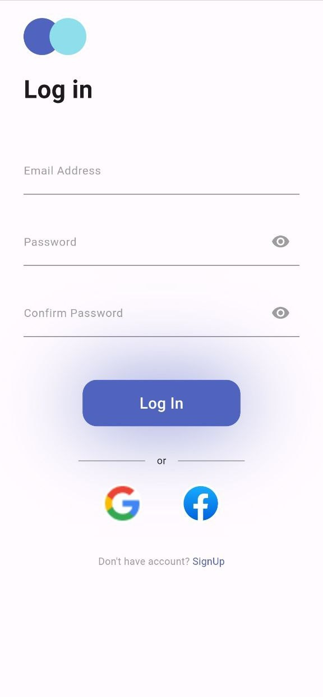
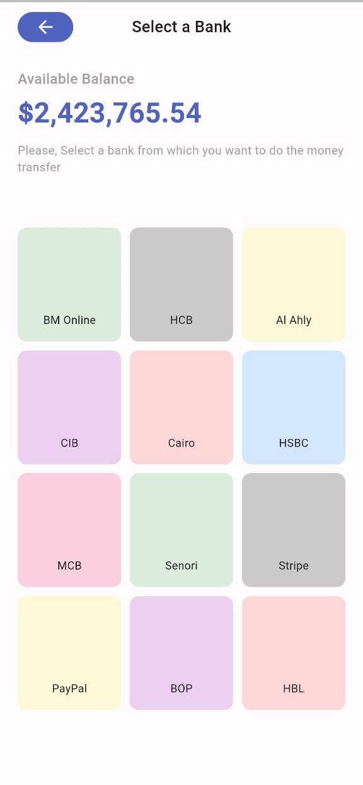

# Transfer App

## Content
 - [Description](#description)
 - [Features](#features)
 - [Tools](#tools)
 - [Screenshots](#screenshots)
 - [APK Path ](#apk-path )


## Description

Transfer App is a user-friendly mobile application built with Flutter, designed to facilitate secure and efficient money transfers. The app enables users to transfer funds seamlessly between accounts, view their transaction history, and manage their profile details. With real-time notifications and robust security features, users can enjoy peace of mind knowing their transactions are safe. The intuitive interface ensures a smooth experience, while multi-currency support and comprehensive error handling cater to a diverse user base. Ideal for those seeking a reliable and modern solution for managing their finances on the go.


## Features

- User Registration & Login: Secure user authentication and account management.
  
- Transfer Funds: Easy money transfer between users within the app.
  
- Transaction History: View past transactions with details such as date, amount, and recipient.
- Real-time Notifications: Get instant alerts for successful transactions, balance updates, and more.
- Balance Check: View current account balance and transaction summaries.
- Secure Transactions: Implementations of encryption and secure protocols to ensure transaction safety.
- Contact Management: Save and manage contacts for quick and easy transfers.
- Profile Management: Update user profile details and settings.
- Multi-currency Support: Handle transactions in multiple currencies, if applicable.
- User-friendly Interface: Designed with a clean and intuitive UI for a smooth user experience.
- Error Handling & Validation: Comprehensive checks to handle input errors and provide feedback.


## Tools


## Screenshots

<p align="center">
  
  
</p>

<p align="center">
  
  
</p>

<p align="center">
  
  
</p>

<p align="center">
  
  
</p>

<p align="center">
  
  
</p>

<p align="center">
  
  
</p>

<p align="center">
  
  
</p>

<p align="center">
  
  
</p>

<p align="center">
  
  
</p>


<p align="center">
  
  
</p>


## Deployment

To deploy this project run this command in terminal

```bash
 flutter build apk
```

## APK Path 
build/app/outputs/flutter-apk/app-release.apk
